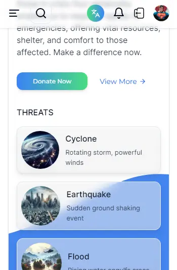

# Localized Disaster Preparedness and Assistance Network

**Problem Statement:** Bangladesh is prone to various natural disasters, such as cyclones, river erosion, floods, and landslides. In many cases, timely information and assistance can save lives and minimize damage. However, there is often a lack of efficient communication and coordination during such events.

**Project Description:** It will be a localized web-based platform that serves as a disaster preparedness and assistance network. This platform will connect communities, local authorities, and volunteers, facilitating the sharing of critical information, resources, and assistance during emergencies.

    
    

---

    
    

    
    
    

### **Key Features:**

**Emergency Alerts:** Provide alerts and notifications about impending disasters, weather conditions, and safety instructions.

**Community Network:** Create a network of local communities, volunteers, and authorities who can share information and collaborate during emergencies.

**Resource Mapping:** Map local resources such as shelters, medical facilities, relief centers, and emergency supply stocks.

**Communication Channels:** Enable instant communication through text, voice, and video messages for effective coordination.

**Volunteer Coordination:** Allow volunteers to register and offer assistance during disasters, matching their skills with specific needs.

**Emergency Plans:** Provide customizable disaster preparedness plans for households and communities.

**Education:** Enlightening the Youth on Disaster Risk Reduction and Climate Change Adaptation

**Data Analytics:** Analyze historical disaster data to predict and plan for future events, optimizing resource allocation.

**Localized Language Support:** Ensure the platform supports local languages and dialects for broader accessibility.

**Offline Access:** Enable offline access to critical information and resources through downloadable guides and materials.

**Collaborative Documentation:** Allow users to document and share their experiences, lessons learned, and best practices for future reference.

**Impact:** This platform would contribute to enhancing disaster preparedness and response at the local level. By providing timely information, coordinating resources, and fostering community collaboration, it could potentially save lives, reduce property damage, and improve overall disaster resilience.
